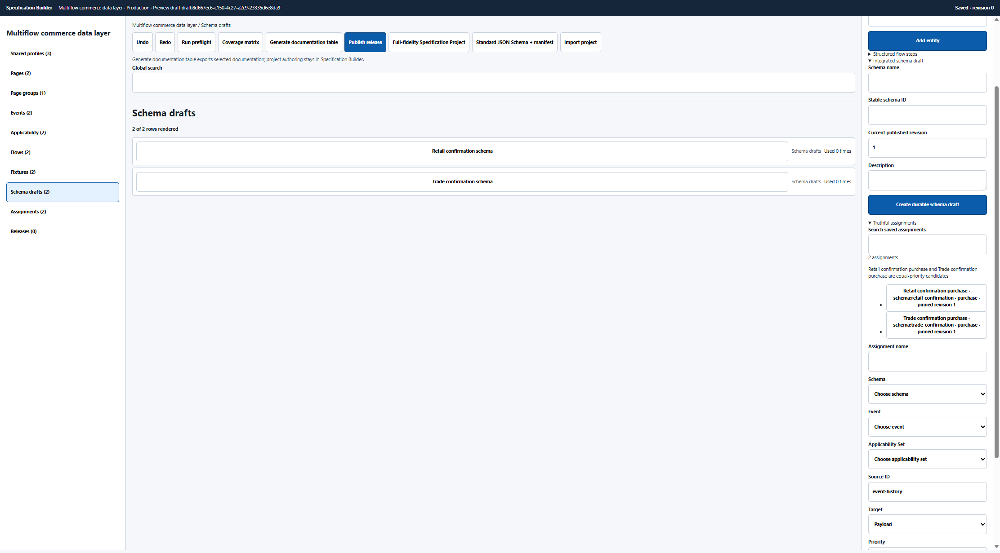
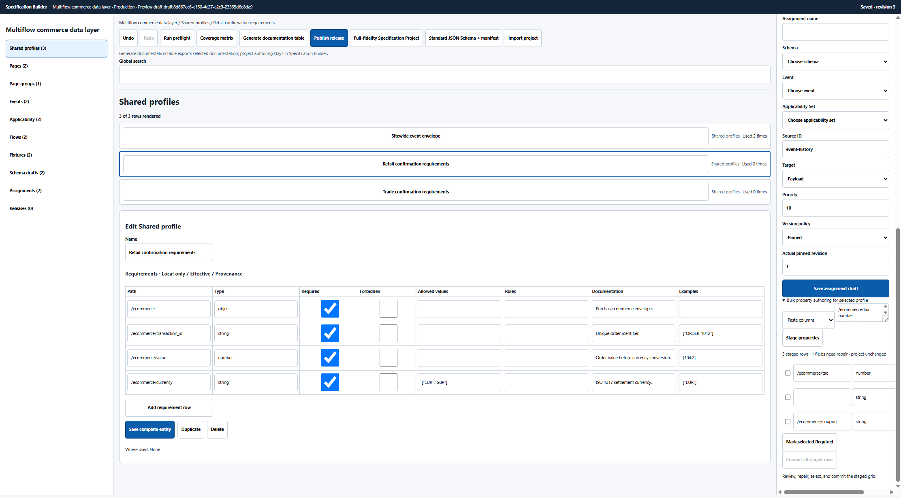
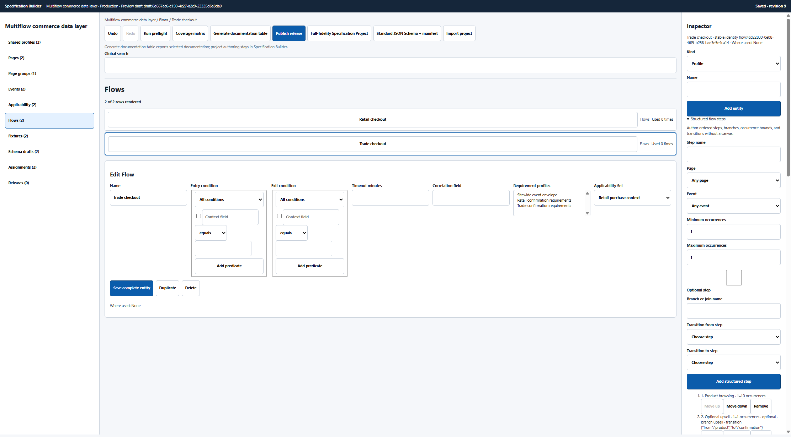
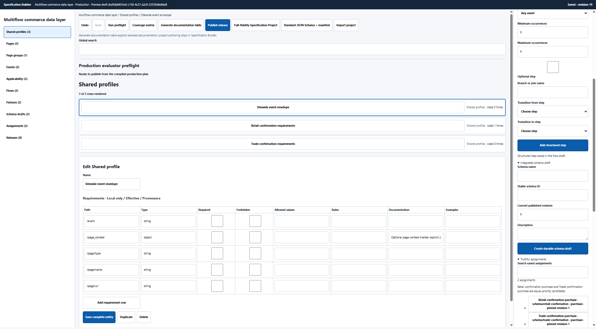
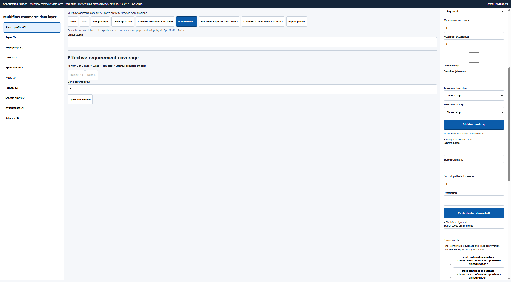
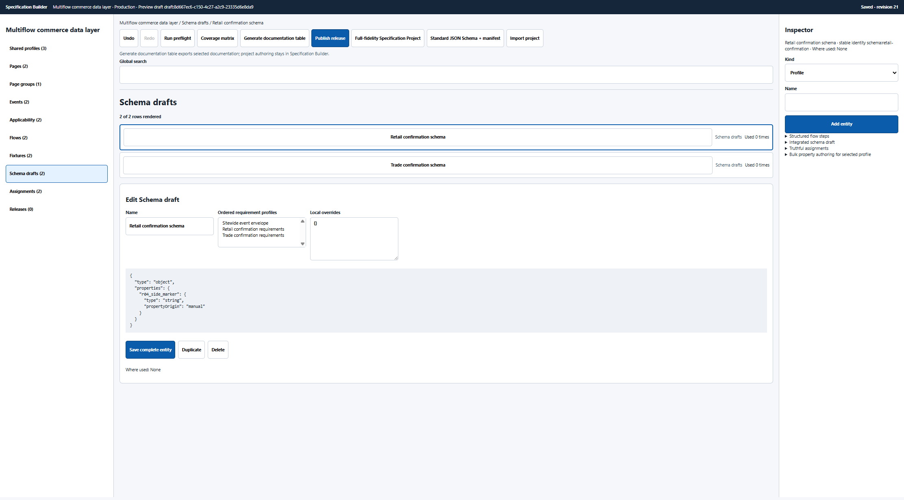
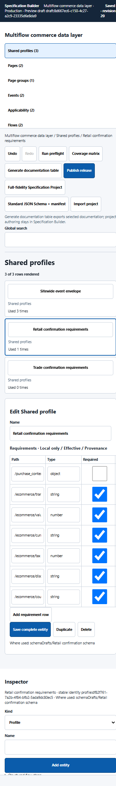
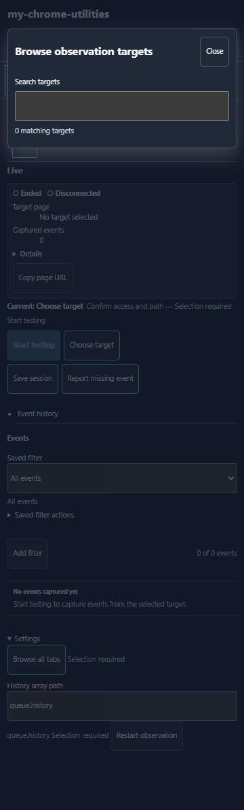

# R04 actual-extension visual walkthrough

This gallery accompanies the [R04 workflow assessment](../../../docs/full-site-data-layer-specification-workflow-assessment-R04.md). It records the installed extension in the existing Chrome QA window at revision `94a73ff`, using the persisted `Multiflow commerce data layer` project.

The walkthrough covered desktop authoring, Retail and Trade flows, requirement staging, applicability, fixtures, assignments, preflight, coverage, release review, reload durability, cross-surface editing, responsive layouts, keyboard behavior, operator guidance, and the Live target boundary. The reviewer used source and runtime inspection to disambiguate controls whose purpose or impact the UI did not explain; a real operator cannot be expected to do that. No release was published and persistent all-tabs browsing permission was not granted.

## Decisive evidence

### The updated desktop foundation is substantially clearer

The hidden-create-screen defect is gone and the three-pane hierarchy is readable. The remaining problem is no longer basic visibility: it is whether the visible controls author the same executable model used by preflight, release, and Live.

### Small bulk edits now have a real repair transaction

Invalid rows remain staged while the project is unchanged, commit is blocked, and the repaired three-row import can be committed and reversed with one Undo/Redo transaction.

### Flow state can become visually stale after switching funnels

The Trade flow is selected while Retail steps remain rendered. Because step actions resolve against the newly selected flow, this is both a comprehension problem and a wrong-flow mutation risk.

### Assurance can report ready with no meaningful proof

After working around the parent/child compiler crash and repairing dangling steps, preflight reports readiness even though fixtures contain no observations or assertions and the production assignment collection is empty.

Coverage then contains zero cells despite profiles, schemas, flows, displayed assignments, and fixtures being present.

### Stale cross-surface editing silently loses newer composition

A visible side-panel property edit preserved that property but silently removed the newer Builder profile composition. The walkthrough restored the links afterward and retained the marker property.

### Narrow layouts expose all panes and clip the requirement grid

At 360 px all three panes stack, the page has several scroll owners, and most requirement columns are clipped outside the usable editor.

### The real Live target boundary remained permission-blocked

The actual side panel had no matching target because it lacked persistent all-tabs browsing permission. That permission was deliberately left unchanged; this is an unexecuted boundary, not a pass.

## Complete walkthrough index

| # | Evidence | Operator moment |
| ---: | --- | --- |
| 01 | [Updated existing project](01-fullpage-updated-existing-project.png) | Desktop three-pane entry state and persisted project graph. |
| 02 | [Page contextual editor](02-fullpage-page-contextual-editor.png) | Discovering full Page identity, route, relationship, and applicability fields. |
| 03 | [Completed Page](03-fullpage-page-complete.png) | Checkout confirmation after saving route, group, event, profile, and forced applicability. |
| 04 | [Event editor](04-fullpage-event-editor.png) | Purchase event authoring with source, target, occurrence, profiles, and applicability. |
| 05 | [Profile editor](05-fullpage-profile-editor.png) | Retail requirement grid and its advertised effective/provenance columns. |
| 06 | [Invalid bulk stage](06-fullpage-bulk-invalid-stage.png) | Three staged requirements, one repair required, project unchanged. |
| 07 | [False compiled preview](07-fullpage-schema-false-compiled-preview.png) | Schema profile links alongside a preview that remains the raw document. |
| 08 | [Human-name applicability](08-fullpage-applicability-human-name.png) | Readable Retail flow condition that the runtime cannot resolve to a stable ID. |
| 09 | [Flow step editor](09-fullpage-flow-step-editor.png) | Human-name Page/Event selectors for a new step. |
| 10 | [Stale flow after switch](10-fullpage-flow-stale-after-switch.png) | Trade selected while Retail steps remain actionable. |
| 11 | [Raw fixture editor](11-fullpage-fixture-raw-json.png) | Context, observations, payload, expectations, and policy exposed as JSON/free text. |
| 12 | [Preflight dead link](12-fullpage-preflight-dead-link.png) | Blocker navigation writes a raw flow-step query but does not open the faulty field. |
| 13 | [Coverage blocked](13-fullpage-coverage-blocked.png) | Coverage unavailable while dangling flow references remain. |
| 14 | [Release blocked](14-fullpage-release-review-blocked.png) | Review correctly blocks before structural repair. |
| 15 | [Silent preflight crash](15-fullpage-preflight-silent-crash.png) | Visible preflight provides no usable compiler error after a normal parent/child contract. |
| 16 | [False-ready preflight](16-fullpage-preflight-false-ready.png) | Readiness after workarounds despite no proving observations or production assignment. |
| 17 | [Zero coverage](17-fullpage-coverage-zero-despite-contract.png) | Zero requirement cells after the false-ready result. |
| 18 | [Assignment editor](18-fullpage-assignment-editor.png) | Contextual assignment authoring that does not populate the production collection. |
| 19 | [False-ready release](19-fullpage-release-false-ready.png) | First release review enables Publish with zero structured changes. |
| 20 | [Release gate disagreement](20-fullpage-release-gate-disagreement.png) | Publication fails under a different gate while canonical bytes remain unchanged. |
| 21 | [Responsive 720](21-fullpage-responsive-720.png) | Three vertically stacked panes and multiple scroll regions. |
| 22 | [Responsive 360](22-fullpage-responsive-360.png) | Clipped requirements and an overlong stacked workspace. |
| 23 | [Cross-surface profile loss](23-fullpage-cross-surface-profile-loss.png) | Newer schema composition removed by a stale side-panel save. |
| 24 | [Side-panel Retail property](24-side-panel-retail-property.png) | Marker property authored through the actual side-panel schema editor. |
| 25 | [Live target blocked](25-side-panel-live-target-blocked.png) | Real Live picker with zero targets under unchanged permissions. |

## Final QA state

- Canonical project revision: 22.
- Releases: 0.
- Retail schema profile links: restored.
- Side-panel marker property: retained.
- Temporary local commerce tab/server: closed and stopped.
- Extension browsing permissions: unchanged.
