# Full-Site Data-Layer Specification Authoring: Visual Walkthrough and Recommendations

## Executive recommendation

The extension should stop presenting this problem as a collection of independently edited schemas and assignments. The primary authoring unit should be a versioned **Specification Project** that connects three distinct layers:

1. **Reusable data requirements** — properties, types, rules, descriptions, examples, and reusable requirement profiles.
2. **Applicability** — the pages, routes, events, environments, payload conditions, and audience or flow state to which requirements apply.
3. **Journeys** — named flows with ordered steps, branches, optional or repeatable steps, transitions, and cross-event state.

The present Schema editor has useful primitives, but it is not yet a safe or navigable way to build a complete multiflow website specification. It can approximate “this current purchase event looks like Retail checkout confirmation.” It cannot express “this purchase belongs to the Retail funnel because the user previously traversed its steps” unless the current event or URL contains a distinguishing marker.

The recommended product shape is:

- A dedicated, full-page extension workspace for complex authoring.
- The side panel retained for capture, inspection, quick fixes, matcher testing, and opening the selected item in the workspace.
- A persistent site/page/event/flow tree, a focused center workspace, and a contextual inspector.
- Ordered composition of reusable requirement profiles instead of one parent and one winning schema.
- Durable autosaved drafts and atomic whole-project releases.
- Bulk-first creation from JSON examples, JSON Schema, spreadsheets, templates, and multi-row editing.
- Static coverage, ambiguity, and flow analysis that works before any live event has been captured.

Before that redesign, the current trust defects should be treated as P0: silent description loss, non-durable new drafts, automatically created blank assignments, contradictory assignment count and empty states, ineffective assignment search, an ambiguous publication lifecycle, and assignment identity/version defects.

## Review context

| Field | Value |
| --- | --- |
| Review round | R01 |
| Date | 17 July 2026 |
| Extension revision | master at 28956fe |
| Browser | Actual unpacked extension in an isolated visible Chrome QA profile |
| Side-panel viewport | 360 × 1191 CSS pixels |
| Starting state | Empty schema library |
| Scenario | Shared sitewide page context plus Retail-funnel checkout-confirmation requirements and routing |
| Methods | Live visual walkthrough, DOM/accessibility snapshots, and targeted source/model review |
| Evidence directory | [artifacts/schema-editor-walkthrough/R01](../artifacts/schema-editor-walkthrough/R01/) |

This was a greenfield authoring review. It deliberately did not rely on captured production traffic, because an operator writing a specification from an external brief must be able to finish and preflight the work before a website implementation exists.

The visual evidence is from the actual 360px side panel. Wider responsive behavior was reviewed in source, but 520px and 720px screenshots were not captured in this round. Those widths should be included in implementation verification.

## Scenario used for the walkthrough

The exercised scenario was intentionally small enough to complete but structurally representative of a larger website:

- A shared schema named **Sitewide page context**.
- Shared properties: event, page.type, page.name, and page.url.
- A specialized child schema named **Checkout confirmation — Retail funnel**.
- Retail-only required properties: ecommerce.transaction_id, ecommerce.value, and ecommerce.currency.
- A purchase assignment for shop.example.test/checkout/confirmation.
- A current-payload discriminator: /funnel_id equals retail.

That last condition is an important limitation, not part of the ideal specification. The current resolver receives the current event and page URL, evaluates assignments, and selects exactly one highest-priority schema. See [data-layer-schema-verification.ts](../src/data-layer-schema-verification.ts#L326) and its priority selection at [line 370](../src/data-layer-schema-verification.ts#L370).

~~~text
Current model
current event + current URL + current payload
                    |
                    v
         one highest-priority schema

Needed for real flows
current event + page context + prior steps + flow/session state
                    |
                    v
 ordered requirement profiles + step expectations + transition validation
~~~

Therefore:

- The current tool can describe “the current event matches Retail confirmation.”
- It cannot prove “the visitor reached this event through the Retail funnel” when Retail and Trade share the same purchase event and confirmation URL and the final payload has no funnel marker.
- The separate replay-sequence feature is an event-push script, not a flow specification: its steps do not reference page contexts, schemas, occurrence rules, transitions, or expected validation outcomes.

## Visual walkthrough of the current workflow

### 1. Start in an empty schema library

The empty library gives Create, Import, Export, and Recheck equal full-width visual weight. Validation headings, an empty library message, and a separate empty Schema details card are all present before the operator has created anything.

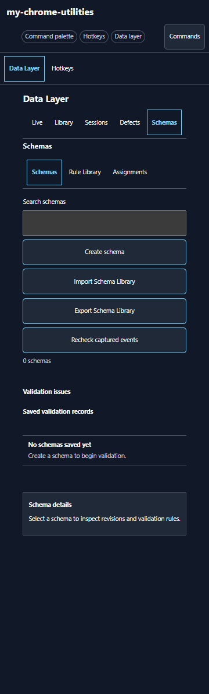

What helps:

- Schemas, Rule Library, and Assignments are discoverable.
- Creation and interchange entry points exist.

What creates friction:

- The first task is not clear because all actions have equal emphasis.
- Empty validation and detail regions consume attention without helping the first-run task.
- The navigation repeats Data Layer and Schemas at several levels, reducing the space available for the work.

### 2. Create the shared schema

Create schema opens the editor inline below the entire library toolbar, validation headings, and empty states. The schema identity fields begin near the bottom of the viewport, and the editor is placed inside another bounded detail region.

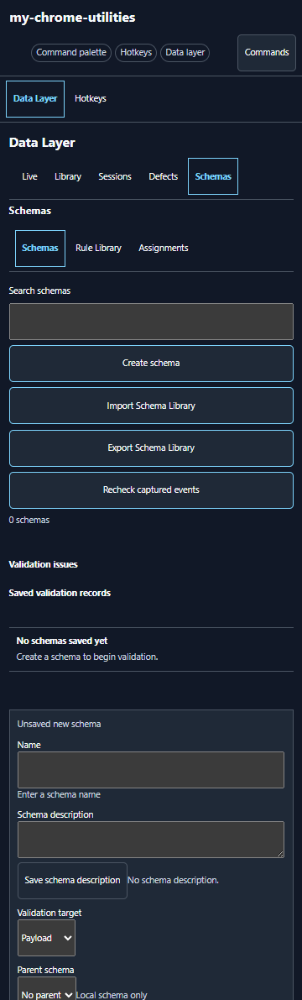

The description has its own Save schema description button. During the walkthrough, the entered description was silently cleared when Add property caused the editor to rerender before that field-specific save was used. The schema name survived. This is a serious trust problem: the visible form looks like one draft, but individual fields have different persistence semantics.

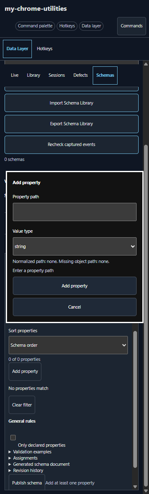

The new schema itself is not added to persistent schema storage until publication. Closing or reloading beforehand can lose it even though the close result says the draft is retained. Relevant creation and close handling is in [side-panel.ts](../src/side-panel.ts#L2524) and [side-panel.ts](../src/side-panel.ts#L4995).

### 3. Add properties and rules one at a time

Adding event as a string, then making it required, required three layers of interaction: Add property, Add rule, select Required, and configure/create the rule. Even a parameterless Required rule opens a configuration form with severity, message, conditional, and reusable-rule controls.

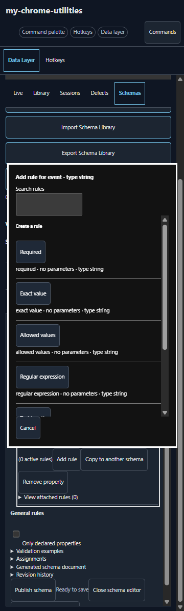

The rule system is capable: conditional rules, severity, custom messages, and reusable rules are valuable foundations. The problem is throughput. Applying Required to three Retail-only attributes required nine rule-dialog actions after the properties had already been created.

Nested paths and automatic container creation are also strong foundations. The editor can create page.type as a child of page, and it can infer the missing ecommerce object when a full path is entered.

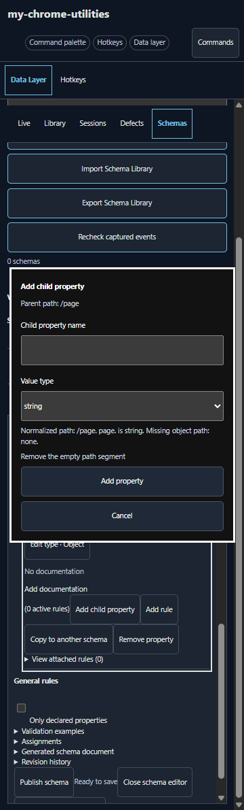

After only event, page, page.type, page.name, and page.url existed, the editor already required a long inner scroll. Every property repeated Edit type, Add documentation, rule count, Add rule, Copy, Remove, and attached-rule content. The schema identity was no longer visible while editing lower properties.

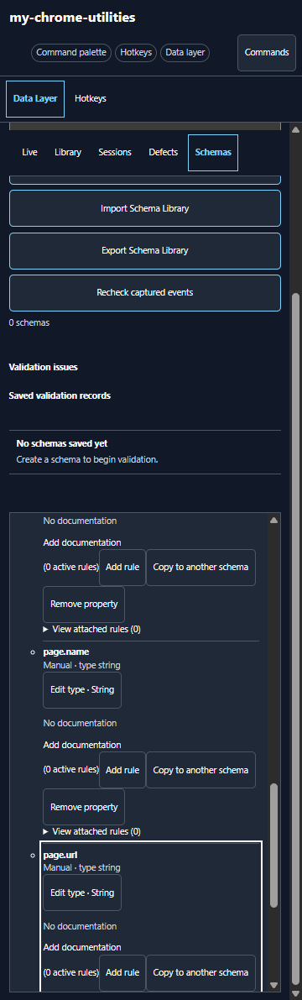

### 4. Publish the shared schema

Publication review says only that the schema will become revision 1. It does not show a property/rule diff, documentation completeness, assignment coverage, affected flows, example failures, or downstream impact.

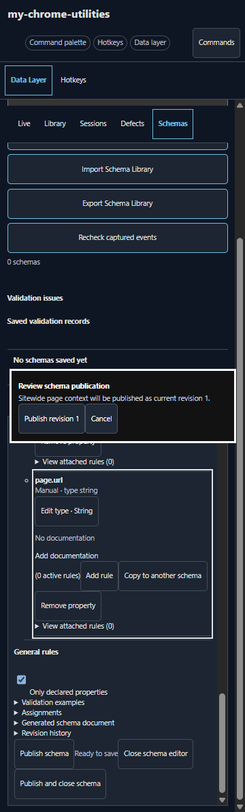

After confirmation, the editor closes even though the chosen action was Publish schema rather than Publish and close schema. Focus returns to the page body, no schema is selected, and the list row becomes a dense sentence followed by six same-weight actions.

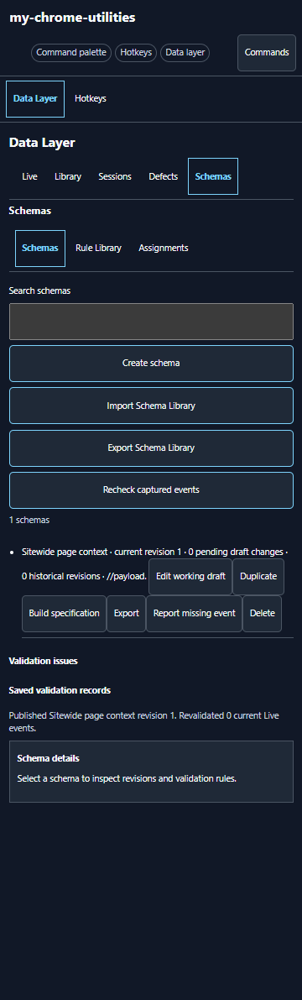

### 5. Build a specialized Retail confirmation schema

The child schema can inherit Sitewide page context. Entering ecommerce.transaction_id correctly previews the canonical path and tells the operator that an ecommerce object will be created. This path normalization should be retained.

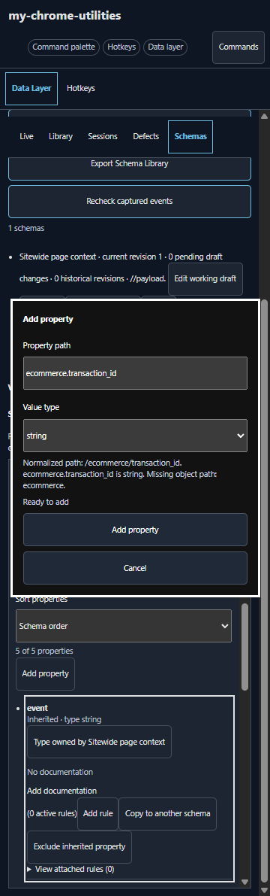

The inheritance experience does not scale visually. Selecting one parent expands inherited-rule override sections and renders every inherited property as another full action row. With nine effective properties—five inherited and four local including the ecommerce container—the editor measured roughly 3,562px high.

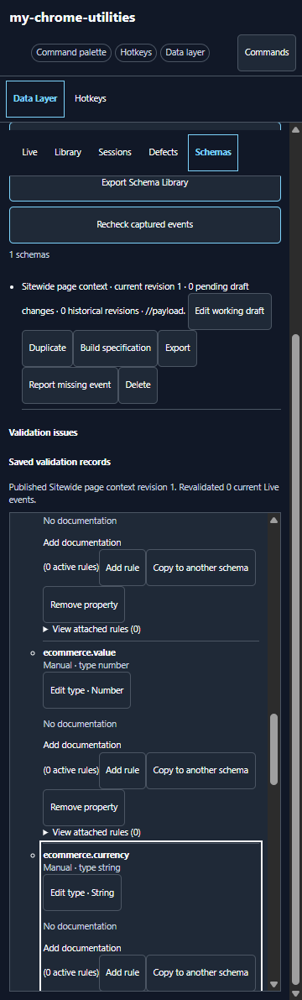

While configuring the three Retail-required fields, the viewport could show only a small slice of the property tree. Neither the schema name nor the current section remained visible. The outer workspace and inner detail pane had separate scrollbars.

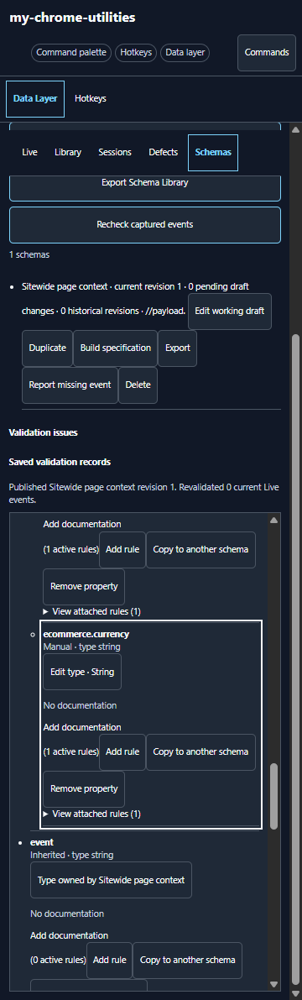

The second publication review has the same limitation: it reports revision 1 but no effective-contract diff, inherited changes, route/flow coverage, or ambiguity analysis.

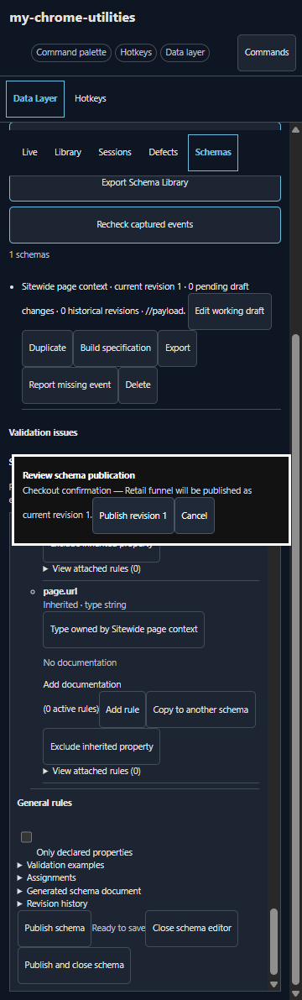

### 6. Move to Assignments to define applicability

Applicability is not authored with the schema. The operator must publish, leave the schema editor, and switch to the separate Assignments tab.

Immediately after the two publications, the Assignments view showed all of the following at once:

- 0 assignments.
- Two visible assignment rows.
- A conflict between two unnamed assignments.
- No assignments saved yet.

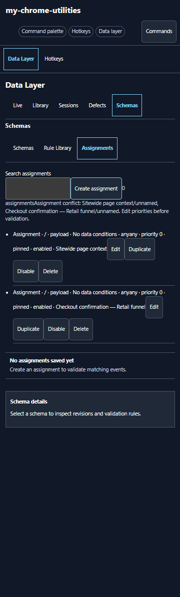

Publishing created blank placeholder assignments with empty source and event data. They conflict with one another. The count and search controls exist in markup at [side-panel.html](../side-panel.html#L218), but the runtime list rendering does not bind them into one truthful state.

This screen is the clearest trust failure in the walkthrough. An operator cannot tell whether no assignments, two assignments, or a conflict is the authoritative result.

### 7. Create the Retail applicability rule

Create assignment opens another long inline form below the contradictory rows. It defaults to the first schema and provides no semantic assignment name such as Retail funnel · Confirmation. The operator must configure:

- Schema.
- Source and exact event name.
- Payload or raw input.
- Domain and pathname text.
- Numeric priority.
- Version policy.
- Enabled state.
- Optional data conditions.

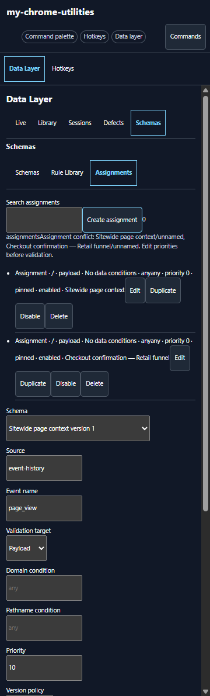

The data-condition builder adds target, flat All/Any logic, property path, detected type, operator, and comparison. It has no nested groups, Not, reusable named condition set, match preview, example event, or visible URL/event test result.

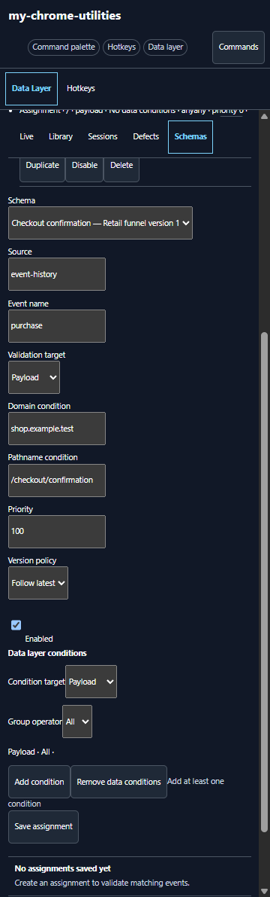

A natural property entry of funnel_id is rejected; /funnel_id is required. No syntax help is placed next to the field. The only useful feedback appears as assistance text near the disabled Save button, well away from the property input.

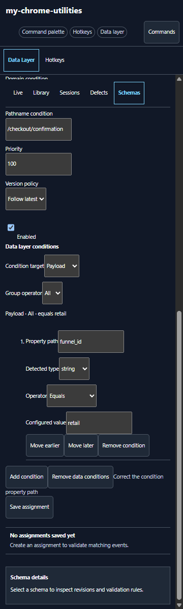

After correcting the canonical path, the assignment can be saved.

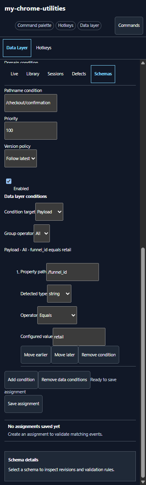

### 8. Inspect the saved applicability result

The saved result adds a third row and automatically names it Checkout confirmation — Retail funnel automatic. However, 0 assignments and No assignments saved yet remain visible, while the two blank conflicting rows also remain.

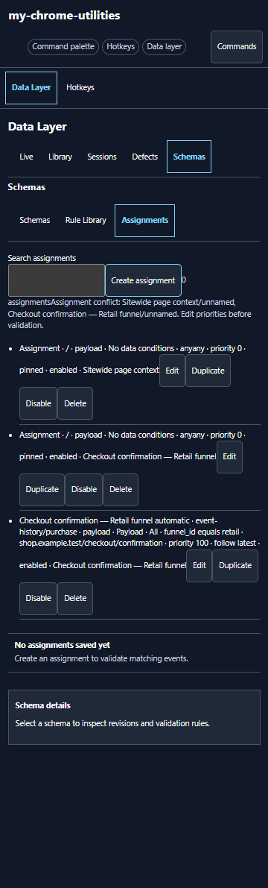

The schema list then summarizes the child as having both //payload and event-history/purchase/payload, exposing the placeholder as if it were meaningful routing.

The underlying assignment model is embedded in each schema rather than represented as a first-class project object. See [data-layer-schema-verification.ts](../src/data-layer-schema-verification.ts#L48). Assignment edits also have several implementation risks:

- Only published schemas are eligible for assignment.
- A new assignment ID is derived from schema ID and event name, so two contextual assignments for the same schema/event can collide.
- Pinned assignments created in the UI omit the schema version that pinning needs.
- The hand editor reconstructs an assignment without preserving richer structured path conditions.
- Assignment edits directly mutate the persisted schema rather than participating in the schema working-draft lifecycle.

Relevant handling is concentrated around [side-panel.ts](../src/side-panel.ts#L5056).

### 9. Use Build specification

Build specification opens below the library rows, validation regions, and saved feedback. The heading begins close to the bottom of the viewport.

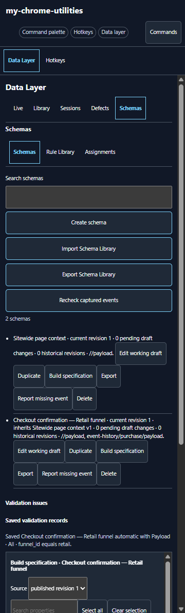

This feature is a useful documentation-table exporter, not a specification builder. It allows property selection, column ordering, example selection, and copy modes for spreadsheets or rich tables. It does not include pages, assignments, applicability, schema relationships, reusable profiles, flows, branches, fixtures, coverage, or release state.

For the nine-property Retail schema:

- The inner builder content was about 1,555px high.
- The detail pane was about 570px high.
- The preview region was 289px wide.
- The table has a CSS minimum inline size of 52rem, creating horizontal scrolling by design. See [side-panel.css](../side-panel.css#L104).

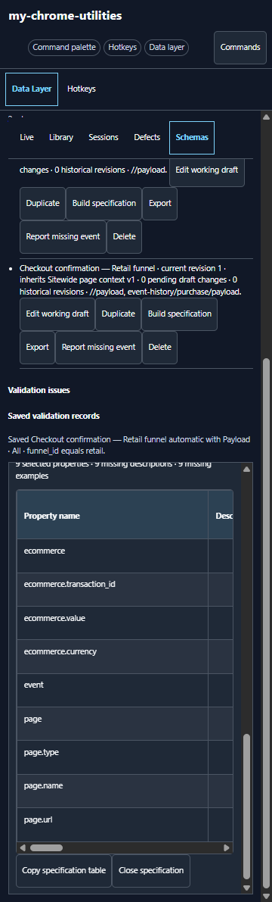

The implementation derives rows from one selected schema and its inherited properties at [data-layer-schema-specification-builder.ts](../src/data-layer-schema-specification-builder.ts#L327). A more accurate name is **Generate documentation table** or **Export property specification**.

## Current operator workflow and its limits

### Best possible workflow in the current build

If an operator must build a large specification in the current version, the least risky approach is:

1. Create one sitewide root schema for the common event envelope.
2. Create children for increasingly specific page/event/funnel contexts, respecting the one-parent limit.
3. Add each property, documentation item, example, and rule individually.
4. Explicitly save the description before any action that rerenders the editor.
5. Publish each schema before routing can be added.
6. Delete or repair blank placeholder assignments immediately after publication.
7. Create a higher-priority assignment for each specialization using event, domain, pathname, and a discriminator in the current payload.
8. Use Follow latest until pinned-version creation is fixed, and manually verify every release.
9. Keep an external Page × Event × Funnel matrix, because Build specification omits applicability and flows.
10. Export a full library backup at each milestone, especially before closing or reloading.

This is a workaround, not the target experience. It has three hard constraints:

- Every funnel specialization must be distinguishable from the current event or URL.
- Global, page, market, authentication, experiment, and funnel concerns must be forced into one inheritance chain because the resolver selects one schema.
- Flow order and prior-step state must be documented and validated outside the tool.

### What should be retained

The redesign should preserve and elevate the strongest existing capabilities:

- Canonical property paths and automatic creation of missing object containers.
- Hierarchical property display.
- Reusable and conditional rules with severity and custom messages.
- Parent inheritance and local override concepts.
- Working drafts, revision history, restore, duplicate, and full-library backup primitives.
- Captured-event suggestions and replay as optional accelerators.
- Assignment priority and resolution evidence.
- Property documentation, examples, allowed values, and the documentation-table exporter.
- Full JSON Schema export as an interoperability surface, with explicit warnings where extension behavior is lossy.

## Why the current information architecture breaks down

| Operator thinks in | Current representation | Consequence |
| --- | --- | --- |
| Website and environments | One local schema library | No project boundary, environment policy, owner, or release scope |
| Shared data contract | One schema or parent | Useful only until several orthogonal concerns need composition |
| Page or page group | Domain/path strings inside assignments | Pages are unnamed, not searchable objects and have no coverage |
| Event contract | Schema plus exact assignment event name | Schema definition and where it applies are split across views |
| Funnel or journey | No entity | Ordering, branching, optional/repeatable steps, and prior state cannot be specified |
| Flow-specific requirement | Child schema plus priority assignment | Variant explosion and manual precedence management |
| Reusable policy | Rule Library or inherited schema | No reusable ordered requirement profile spanning several contexts |
| Complete specification | Individual published schema revisions | No atomic site-wide release or consistency boundary |
| Validation plan | Captured events | Greenfield specifications cannot be preflighted without fixtures |
| Deliverable | One-schema property table or library backup | Neither output is a readable, complete page/event/flow specification |

The single-parent model is visible at [data-layer-schema-verification.ts](../src/data-layer-schema-verification.ts#L298), and the single-winner assignment resolver is visible at [data-layer-schema-verification.ts](../src/data-layer-schema-verification.ts#L326).

## Recommended target experience

### 1. Use a full-page authoring workspace

Complex specification work should open in an extension tab. The side panel remains valuable while browsing the website, but it is the wrong physical surface for a 500-property, 50-page, multiflow authoring project.

~~~text
┌──────────────────────────────────────────────────────────────────────────────┐
│ Project / Site / Environment / Draft                     Undo  Preflight  Publish │
├──────────────────┬──────────────────────────────────────┬────────────────────┤
│ Project tree     │ Active workspace                     │ Inspector          │
│                  │                                      │                    │
│ Overview         │ Outline / property grid              │ Identity           │
│ Shared profiles  │ Page-event coverage matrix           │ Applicability      │
│ Pages & groups   │ Structured flow step list            │ Requirements       │
│ Events           │ Fixture results                      │ Where used         │
│ Flows            │ Release diff                         │ Issues              │
│ Fixtures         │                                      │                    │
│ Releases         │                                      │                    │
├──────────────────┴──────────────────────────────────────┴────────────────────┤
│ Contextual issue summary · selection · autosave state · background validation │
└──────────────────────────────────────────────────────────────────────────────┘
~~~

The side panel should offer:

- Capture current event as a fixture or property suggestion.
- Show which page, event, flow step, and profiles apply now.
- Test the current URL and event against applicability.
- Show validation results and open an issue at its exact workspace location.
- Make a small safe edit.
- Open the full specification workspace with selection and context preserved.

### 2. Make the greenfield operator workflow explicit

The ideal from-scratch flow is:

1. **Create a Specification Project.** Name the site, add environments, choose naming conventions, and set publication policies.
2. **Choose a starting method.** Blank; template; paste a JSON example; import JSON Schema/OpenAPI-style components; paste spreadsheet rows; or import a full project.
3. **Define shared profiles.** Create the common event envelope, commerce objects, identity context, consent context, and other reusable requirements.
4. **Inventory pages and events.** Add pages/page groups and event definitions, with named applicability sets rather than anonymous condition strings.
5. **Build flows.** Add ordered steps, branches, optional/repeatable steps, entry/exit conditions, and flow variables. Attach page/event definitions and requirement profiles to each step.
6. **Bulk author requirements.** Edit paths, types, requirement level, descriptions, examples, allowed values, and rules in a pasteable grid. Use multi-selection for shared changes.
7. **Add fixtures and test matchers.** Paste representative single events and complete journeys. See exactly which contexts, profiles, and flow steps match and why.
8. **Review coverage and impact.** Resolve uncovered contexts, ambiguous or shadowed matchers, rule conflicts, unreachable branches, missing documentation, and failing fixtures.
9. **Publish one project release.** Review a structured diff and impacted consumers, then release all linked schemas, applicability, flows, and fixtures atomically.
10. **Export.** Produce full-fidelity project JSON plus selected documentation formats and standard JSON Schema with a companion applicability/flow manifest.

The workspace should remember the selected item, expanded nodes, filter, scroll position, and active view when the operator moves between flows or closes and reopens the tool.

### 3. Introduce a domain model aligned with the work

| Entity | Purpose | Key fields or relationships |
| --- | --- | --- |
| SpecificationProject | Stable authoring and release boundary | ID, name, sites, environments, conventions, owners, current draft, releases |
| SiteEnvironment | Host and runtime scope | Domains, base paths, route mode, query/hash policy, environment variables |
| RequirementProfile | Reusable ordered data contract | Properties, structural constraints, rules, documentation, examples, precedence |
| PageDefinition | Named page or SPA route context | Page/group name, applicability set, parameters, expected events, profiles |
| EventDefinition | Named event semantics | Event name/source, target, profiles, documentation, occurrence policy |
| ApplicabilitySet | Reusable matcher logic | URL/event/data/session predicates, nested logic, plain-language summary |
| FlowDefinition | Named journey | Entry/exit, variables, ordered nodes, branches, release ownership |
| FlowStep | One expected point in a journey | Page/event reference, occurrence min/max, profiles, transitions, fixtures |
| Fixture | Preflight evidence | Single event or ordered journey, URL/state, expected match and issues |
| ProjectRelease | Atomic published snapshot | Version, diff, approvals, references, migration notes, full project payload |

Schemas should not own assignments. Applicability should be independently named, reusable, searchable, testable, and referenced by pages, events, profiles, or steps.

### 4. Treat flows as real temporal specifications

A flow should be more than a folder. It should support:

- Ordered steps and explicit transitions.
- Optional steps and min/max occurrence counts.
- Repeatable product, search, or form steps.
- Branches and joins.
- Entry and exit conditions.
- Expected page and event combinations.
- Flow-level variables or discriminators derived from earlier steps.
- Timeouts or “must occur before” rules where needed.
- Flow-specific requirement overlays.
- Success and failure fixtures.

For example, Retail and Trade can both end on /checkout/confirmation with purchase. Earlier steps establish a flow instance. The Retail confirmation step composes Sitewide + Commerce + Retail confirmation profiles; Trade composes Sitewide + Commerce + Trade account + Purchase order profiles.

If runtime temporal tracking is deliberately out of scope, the UI and documentation must say **Organizational flow** and must not imply that traversal is validated. Even in that reduced scope, flow steps and coverage still need first-class authoring and export.

### 5. Use deterministic ordered composition

Replacing one parent with arbitrary multiple inheritance would create diamond and precedence problems. Use explicit ordered profiles or overlays instead:

1. Project baseline.
2. Page/page-group profile.
3. Event profile.
4. Flow profile.
5. Flow-step override.
6. Environment exception.

Every effective property and rule should show:

- Origin profile.
- Precedence.
- Whether it is inherited, overridden, disabled, or conflicting.
- Where it is used.
- Which release introduced the value.

Conflicts should be explicit, not silently last-write-wins. The effective-contract preview should let the operator switch between “effective,” “local only,” and “show provenance.”

### 6. Replace raw assignment fields with a matcher builder

The matcher builder should support:

- Host exact, glob, and regex.
- Path exact, glob, regex, and named route templates.
- Query parameter and hash conditions.
- SPA route variables.
- Source and event name.
- Payload and raw-input predicates.
- Flow/session variables and prior-step state.
- Nested All, Any, and Not groups.
- Reusable named condition sets.
- Include/exclude conditions and fallbacks.

Every matcher should display a plain-language summary such as:

> Applies to purchase events on shop.example.test/checkout/confirmation when current flow is Retail.

The editor should include:

- Test current page/event.
- Test pasted URL/event.
- Test saved fixtures.
- Show all candidates, their scores/priority, the winner, shadowed matches, and ties.
- Normalize a natural property path inline rather than rejecting it at Save.
- Explain syntax at the field and highlight the exact invalid segment.

### 7. Make bulk authoring the default

The primary property editor should be a spreadsheet-like grid with columns such as:

| Path | Type | Requirement | Description | Example | Allowed values | Origin | Issues |
| --- | --- | --- | --- | --- | --- | --- | --- |

Required throughput features:

- Paste multiple rows from a spreadsheet.
- Paste or upload JSON examples and infer candidate structures.
- Import JSON Schema/OpenAPI-style definitions.
- Add a reusable object subtree.
- Clone a page, event, profile, or whole flow.
- Multi-select and apply Required, documentation, severity, or allowed values once.
- Fill down, rename paths, move subtrees, and convert types in bulk.
- Preview source provenance and parse problems before committing.
- Undo the whole import or bulk action in one step.

Captured traffic should accelerate authoring, not be required for it.

### 8. Add whole-spec coverage and static analysis

Preflight must work without live traffic and should continuously detect:

- Pages, events, or flow steps with no effective requirements.
- Requirement profiles that are never used.
- Overlapping, shadowed, or equal-priority applicability.
- Broader matchers that unintentionally hide specific ones.
- Unreachable branches and broken transitions.
- Missing flow entry or exit.
- Missing required event occurrence.
- Conflicting profile composition.
- Unresolved references and deleted dependencies.
- Pinned references to missing revisions.
- Missing descriptions, examples, and fixtures.
- Failing success fixtures and unexpectedly passing failure fixtures.
- Breaking changes to downstream pages, flows, and exports.

The result should be a coverage matrix that can pivot across:

- Page/route × event.
- Flow × step.
- Context × requirement profile.
- Fixture × expected winner.
- Property/rule × where used.

Errors, policy blockers, and completeness warnings should remain distinct. Documentation omissions should not automatically block publication unless the project policy says they do.

### 9. Make publication a whole-project decision

All edits should autosave to a durable project draft. Remove field-level save buttons such as Save schema description.

Publication review should show:

- Added, removed, renamed, and changed properties.
- Structural and rule changes.
- Applicability and priority changes.
- Flow and transition changes.
- Fixture results.
- Coverage delta.
- Affected pages, flows, and consumers.
- Breaking-change classification.
- Errors and policy warnings.

Publish should keep the workspace open. Publish and close should close it. Focus should return to the invoking action or a clear release summary.

The project release must snapshot stable references across profiles, pages, events, applicability, flows, and fixtures. Individual schema publication should not be able to leave a project in a mutually inconsistent state.

## Navigation and “do not get lost” design

The main navigation problem is not merely vertical length; it is the absence of persistent semantic location.

Required safeguards:

- A sticky breadcrumb: Project › Flow › Step › Event › Profile › Property.
- A persistent project/environment/revision/draft indicator.
- Back and forward navigation through selection history.
- A compact tree with type, origin, issue, and usage badges.
- Only the selected item opens in the inspector; do not render every control on every property row.
- Collapse inherited branches by default while keeping their effective status visible.
- Global search across names, property paths, documentation, rules, URLs, matchers, pages, events, flows, and fixtures.
- “Where used” and impact links on every reusable object.
- Deep links from preflight issues to the exact field.
- Saved views and filters for large teams or domains.
- Preservation of tree expansion, selection, filter, and scroll state.
- Virtualized lists and grids so large specifications do not render thousands of controls.

An optional flow diagram is useful as an overview. It should not be the primary editor. A structured step list and coverage matrix will be faster to author, easier to compare, and more accessible.

## Look-and-feel recommendations

### Visual hierarchy

- Reduce duplicate headers and keep the product/site context in one compact top bar.
- Make Create specification or Add item the clear primary action. Move import, export, and recheck into a toolbar or overflow menu.
- Use semantic rows with labelled columns and badges instead of punctuation-concatenated prose.
- Separate destructive actions from the everyday action group.
- Use a consistent 8px spacing rhythm, restrained surface elevation, and clear section boundaries.
- Give dialogs and sheets a visually distinct surface from the editor behind them.
- Keep metadata secondary but readable; do not reduce it to an unbroken sentence.

### Responsive behavior

- At side-panel widths, show one active pane and one vertical scroll owner.
- Present add/edit dialogs as a full-height sheet with a sticky title and action bar.
- Do not put a 48vh scrolling detail pane inside the already scrolling side panel. The current rule is at [side-panel.css](../side-panel.css#L248).
- At wide extension-tab widths, use persistent tree/workspace/inspector panes.
- Replace the 52rem documentation table on narrow screens with cards, a selected-column view, or a deliberate full-page export preview.
- Responsive design should change modes rather than compress the entire desktop workspace into 360px.

### Honest state and feedback

- Empty state, row count, conflict status, and filtered results must derive from the same state.
- Keep autosave status local and persistent: Saving…, Saved, Offline draft, or Save failed.
- Put validation beside the failing input and provide a summary that links back to it.
- Show plain-language applicability and effective-contract summaries before technical expressions.
- Never close an editor after an action labelled only Publish.

### Accessibility

- Give every property-tree disclosure button a name that includes its property.
- Implement tree/grid keyboard behavior, not a long generic tab sequence through every row action.
- Trap focus in modal sheets and restore it to the invoking control.
- Keep the sticky identity/breadcrumb in the reading order.
- Announce scoped save, validation, matcher-test, and publication results without repeating the entire page.
- Do not use color alone for origin, severity, match state, or draft state.
- Maintain 44px touch targets in the side panel while allowing denser keyboard/mouse rows in the full workspace.

## Prioritized recommendation register

| ID | Priority | Recommendation | Primary outcome |
| --- | --- | --- | --- |
| DLSP-01 | P0 | Restore state integrity and truthful UI | Operators can trust that visible data and counts are real |
| DLSP-02 | P0 | Add a full-page Specification Project workspace | Complex projects become navigable |
| DLSP-03 | P0 | Model pages, applicability, flows, steps, and releases first-class | Multiflow requirements become representable |
| DLSP-04 | P0 | Replace one-winner inheritance with ordered profile composition | Shared and contextual rules scale without variant explosion |
| DLSP-05 | P0 | Make drafts durable and releases atomic | Work survives and publication is consistent |
| DLSP-06 | P0 | Make property/rule authoring bulk-first | Greenfield creation becomes fast enough |
| DLSP-07 | P0 | Add a guided matcher builder and routing analysis | Applicability becomes understandable and testable |
| DLSP-08 | P0 | Add fixtures, coverage, and whole-spec preflight | Specifications can be proven before implementation |
| DLSP-09 | P1 | Add compact navigation, global search, provenance, and impact | Operators stop losing their place |
| DLSP-10 | P1 | Add full-fidelity project interchange and staged diff/merge | Specifications become portable and reviewable |
| DLSP-11 | P1 | Rename and rescope Build specification | Product language matches actual behavior |
| DLSP-12 | P1 | Establish a responsive visual and accessible interaction system | The tool feels coherent and remains usable at scale |

### DLSP-01: Restore state integrity and truthful UI

**Priority:** P0

**Evidence:** Description loss during property creation; [assignment contradiction](../artifacts/schema-editor-walkthrough/R01/13-360-assignments-empty.png); [saved row with 0 count and empty state](../artifacts/schema-editor-walkthrough/R01/19-360-assignment-saved-result.png); unexpected editor closure after Publish.

**Recommended change:** Fix the state model before layering new authoring features onto it.

**Acceptance criteria:**

- Name, description, property, rule, documentation, assignment, and flow edits survive rerender, navigation, reload, and crash without a field-specific save.
- Publishing a schema creates no assignment unless the operator explicitly created one.
- Assignment count, visible rows, empty state, conflict state, and search results always agree.
- Search filters assignment rows and updates the count.
- Publish keeps the editor open; Publish and close closes it and restores focus predictably.
- Every assignment receives a stable unique ID independent of schema/event text.
- Pinned assignments store and display the pinned version.
- Editing preserves structured path conditions and all unedited fields.
- Assignment edits go through the same draft/release lifecycle as the rest of the project.

**Product value:** No full-site workflow is credible until operators can trust that the UI will not lose, invent, or contradict their work.

**Likely implementation areas:** [side-panel.ts](../src/side-panel.ts), [side-panel.html](../side-panel.html#L218), [data-layer-schema-verification.ts](../src/data-layer-schema-verification.ts), assignment condition UI, storage adapters, state-transition tests.

### DLSP-02: Add a full-page Specification Project workspace

**Priority:** P0

**Evidence:** The five-property schema already loses its identity while scrolling; the nine-property child reaches roughly 3,562px; the current detail pane is capped at 48vh.

**Recommended change:** Create an extension-tab workspace with project tree, active workspace, inspector, sticky project/release state, and one primary scroll owner. Keep the side panel as a contextual companion.

**Acceptance criteria:**

- The operator can open a selected project/page/event/flow/property from the side panel into the full workspace with context preserved.
- The workspace exposes Overview, Shared profiles, Pages, Events, Flows, Fixtures, and Releases.
- Schema/profile identity, project, environment, revision, and autosave state remain visible.
- A 500-property, 50-flow project does not render every editor control simultaneously.
- Selection, expanded nodes, filter, and scroll position survive navigation and reload.
- At 360px the side panel shows one active work pane; at full-page widths the tree/workspace/inspector layout is persistent.

**Product value:** The tool gains enough spatial and navigational structure for sustained specification work without sacrificing in-page QA.

**Likely implementation areas:** new extension page/route, shared project store, side-panel deep links, [side-panel.css](../side-panel.css), navigation and persistence tests.

### DLSP-03: Model pages, applicability, flows, steps, and releases first-class

**Priority:** P0

**Evidence:** The current schema model embeds assignments and has no page, flow, step, branch, occurrence, or session-state entity. The resolver sees only the current event and URL.

**Recommended change:** Introduce SpecificationProject, PageDefinition, EventDefinition, ApplicabilitySet, FlowDefinition, FlowStep, Fixture, and ProjectRelease.

**Acceptance criteria:**

- An operator can define Retail and Trade funnels that share the same purchase event and confirmation URL.
- Prior flow state can select the appropriate confirmation requirements when the final event contains no funnel marker.
- Flows support ordered, optional, repeatable, and branched steps with entry/exit and transition conditions.
- Every flow step references named page/event definitions and composed profiles.
- Project release export/import preserves all entities and stable references.
- If temporal runtime validation is disabled, flows are explicitly labelled organizational and no traversal claim is shown.

**Product value:** The user’s core multiflow requirement becomes representable rather than approximated through naming and priority.

**Likely implementation areas:** new project/flow model modules, validation engine, storage format migration, sequence integration, project release service.

### DLSP-04: Replace one-winner inheritance with ordered profile composition

**Priority:** P0

**Evidence:** One parent and one winning schema force sitewide, page, event, market, identity, experiment, and funnel rules into deep chains or duplicated combinations.

**Recommended change:** Compose deterministic ordered requirement profiles with explicit precedence, conflict diagnostics, and property/rule provenance.

**Acceptance criteria:**

- A context can compose Sitewide + Commerce + Purchase + Retail confirmation without creating a combined child for every possible variant.
- Every effective requirement shows its origin and precedence.
- Incompatible types, required/forbidden combinations, and intersecting allowed values produce clear conflicts.
- Operators can preview effective, local-only, and provenance views.
- Reordering profiles shows a before/after impact preview.
- Arbitrary multiple inheritance and silent last-write-wins are not introduced.

**Product value:** Shared requirements remain reusable while contextual variants stay manageable.

**Likely implementation areas:** effective-schema resolver, rule composition, provenance model, inspector, export flattening, conflict tests.

### DLSP-05: Make drafts durable and releases atomic

**Priority:** P0

**Evidence:** New schemas are not persistently stored before publication; description has a separate save; assignments mutate published data separately; publication review is schema-local and minimal.

**Recommended change:** Autosave one durable project draft, add undo/recovery history, and publish one atomic project release.

**Acceptance criteria:**

- Every edit autosaves and recovers after extension reload or browser restart.
- No individual field has a separate save lifecycle.
- Undo/redo covers property, bulk, matcher, and flow edits.
- Publication review includes requirements, applicability, flow, fixture, coverage, and impact changes.
- Project publication either commits all referenced entities or none.
- Publish remains open; Publish and close is separate.
- Operators can restore a previous whole-project release as a new draft.

**Product value:** Operators can safely make broad connected changes and review them as one coherent specification.

**Likely implementation areas:** project draft store, autosave/recovery, undo transaction model, publication service, diff UI, version migration.

### DLSP-06: Make property and rule authoring bulk-first

**Priority:** P0

**Evidence:** Three required local fields needed nine rule-dialog actions after one-at-a-time property creation. Each property repeats its full action set.

**Recommended change:** Add a pasteable grid, import staging, multi-selection, reusable subtree insertion, and bulk rules/documentation.

**Acceptance criteria:**

- Pasting at least 100 property rows produces a parse preview and can be committed in one operation.
- JSON examples and JSON Schema can create a staged candidate tree without live capture.
- One operation can apply Required, severity, description, or allowed values to a multi-selection.
- Bulk changes show errors per row and can be undone once as a transaction.
- Cloning clearly distinguishes shared references from independent copies.
- Source provenance is retained so imported and manually authored content can be audited.

**Product value:** The operator spends time defining semantics, not opening the same dialogs hundreds of times.

**Likely implementation areas:** new property-grid component, import adapters, schema mutation transactions, reusable profile/subtree library, undo service.

### DLSP-07: Add a guided matcher builder and routing analysis

**Priority:** P0

**Evidence:** The raw assignment form has no semantic name or test preview; /funnel_id syntax is rejected only at Save; logic is one flat All/Any group.

**Recommended change:** Replace anonymous assignment fields with named Applicability Sets, nested logic, field-level guidance, and a candidate/winner tester.

**Acceptance criteria:**

- Matchers support host/path/query/hash/route, source/event, payload/raw input, flow state, and nested All/Any/Not groups.
- Every matcher has a semantic name and plain-language summary.
- Natural property paths are normalized or corrected inline with an exact error.
- Test current context, pasted context, and fixture actions show match/non-match reasons.
- A routing matrix shows all candidates, winner, tie, shadowed rules, and fallback.
- Static analysis catches overlapping wildcard/regex scopes, not only identical configurations.

**Product value:** Operators can understand and prove where requirements apply without mentally evaluating raw strings and priority numbers.

**Likely implementation areas:** applicability model, [data-layer-path-conditions.ts](../src/data-layer-path-conditions.ts), condition-group model/UI, resolver evidence, overlap analyzer.

### DLSP-08: Add fixtures, coverage, and whole-spec preflight

**Priority:** P0

**Evidence:** Publish readiness currently checks a small schema-local subset, while Recheck captured events is useless for a greenfield project with no live corpus.

**Recommended change:** Make fixtures and continuous whole-project preflight part of authoring.

**Acceptance criteria:**

- Operators can paste single-event and ordered-flow fixtures before a site exists.
- Success and failure fixtures declare expected applicability, flow step, and validation result.
- Preflight finds uncovered contexts, ambiguous applicability, unreachable branches, profile conflicts, missing references, and breaking changes.
- A coverage matrix deep-links every cell and issue to its source.
- Publication distinguishes errors, policy blockers, and completeness warnings.
- The decisive Retail/Trade scenario detects a deliberately ambiguous matcher before release.

**Product value:** The specification becomes an executable, reviewable contract rather than documentation that can only be checked after implementation.

**Likely implementation areas:** fixture model/runner, flow evaluator, static analyzer, coverage UI, publication policy engine.

### DLSP-09: Add compact navigation, global search, provenance, and impact

**Priority:** P1

**Evidence:** Property controls expand inline, inherited content greatly increases height, schema search omits property paths/docs/matchers/flows, and there is no breadcrumb or where-used view.

**Recommended change:** Use compact outline rows and a selected-item inspector, backed by semantic global search and selection history.

**Acceptance criteria:**

- A property row shows name/path, type, requirement, origin, issue count, and usage count in one line.
- Details and actions appear only for the selected row.
- Global search indexes every project entity plus property paths, documentation, rules, matcher terms, and fixture names.
- Back/forward returns to prior selections and preserved scroll/filter state.
- Where used lists pages, events, profiles, flow steps, fixtures, and releases.
- Editing a reusable item shows affected consumers before commit/publication.

**Product value:** Operators retain orientation and can move across a large specification without recreating context from memory.

**Likely implementation areas:** project index, outline/tree component, inspector, navigation history, usage graph, impact service.

### DLSP-10: Add full-fidelity project interchange and staged diff/merge

**Priority:** P1

**Evidence:** Current import accepts a versioned library backup, reviews mainly counts, and can replace matching IDs without an item-level dependency diff. Standard JSON Schema export cannot carry applicability or flow semantics.

**Recommended change:** Add a stable project format and a validate → migrate → diff → resolve → commit import workflow.

**Acceptance criteria:**

- Full export round-trips profiles, pages, events, applicability, flows, fixtures, drafts/releases, and stable references.
- Import reports item-level additions, changes, removals, conflicts, and downstream impacts.
- ID collision, rename, and dependency choices are explicit.
- A failed import changes nothing.
- Standard JSON Schema remains available for contract interoperability.
- Applicability, flow, fixture, and release metadata export in a companion manifest with documented versioning.

**Product value:** Specifications can be reviewed, backed up, migrated, and shared without losing the semantics the tool adds beyond JSON Schema.

**Likely implementation areas:** project serialization, migration registry, import transaction/diff UI, JSON Schema exporter, manifest schema.

### DLSP-11: Rename and rescope Build specification

**Priority:** P1

**Evidence:** The feature selects properties from one schema and copies a table; it excludes applicability and flows and deliberately overflows narrow screens.

**Recommended change:** Rename the current feature to Generate documentation table or Export property specification. Reserve Specification Builder for the full project workspace.

**Acceptance criteria:**

- Product labels accurately distinguish authoring from documentation export.
- Documentation export can optionally include origin, applicability summary, page/event/flow usage, and release metadata.
- Narrow screens offer cards or selected columns rather than requiring a 52rem table.
- Full-page export preview remains available when the whole table is useful.
- The exporter clearly labels lossy or omitted semantics.

**Product value:** Operators choose the right feature with correct expectations, and the existing exporter remains useful.

**Likely implementation areas:** [data-layer-schema-specification-builder-ui.ts](../src/data-layer-schema-specification-builder-ui.ts), [data-layer-schema-specification-builder.ts](../src/data-layer-schema-specification-builder.ts), labels and export templates, responsive CSS.

### DLSP-12: Establish a responsive visual and accessible interaction system

**Priority:** P1

**Evidence:** Nested scrollbars, repeated controls, weak modal elevation, equal-weight actions, concatenated metadata, off-screen context, and unnamed property-tree controls appear across the walkthrough.

**Recommended change:** Build shared patterns for app shell, list row, tree/grid, inspector, sheet/dialog, sticky actions, badges, empty states, and feedback.

**Acceptance criteria:**

- Every mode has one primary vertical scroll owner.
- Side-panel forms open as full-height sheets with sticky title/context/actions.
- Primary, secondary, overflow, and destructive actions are visually distinct.
- Empty and conflict states are mutually exclusive and truthful.
- Keyboard-only users can navigate the tree/grid, add a property/rule, test a matcher, and publish.
- Dialog focus is trapped and restored; every disclosure has a contextual accessible name.
- Status and severity never depend on color alone.
- A 500-property project remains responsive and list/grid rendering is virtualized.
- Layout/keyboard tests cover 360px, 520px, 720px, and the full-page workspace.

**Product value:** The redesigned capability feels intentional, remains understandable at scale, and does not trade density for accessibility.

**Likely implementation areas:** design tokens/components, side-panel and workspace CSS, tree/grid semantics, focus manager, responsive and accessibility test suites.

## Delivery sequence

### Phase 0 — Restore trust

- Fix description and new-draft persistence.
- Stop blank assignment creation.
- Bind assignment count/search/empty/conflict state.
- Fix assignment identity, pinned version, structured-path preservation, and published-state mutation.
- Correct Publish versus Publish and close behavior.
- Add regression tests for every observed contradiction.

**Exit gate:** The current small-schema workflow never loses data, invents routing, or shows contradictory state.

### Phase 1 — Build the authoring shell and throughput

- Introduce Specification Project storage and the full-page workspace shell.
- Add persistent tree, inspector, breadcrumb, search, autosave, undo, and issue deep links.
- Add property grid, paste/import staging, reusable subtrees, and bulk actions.
- Keep current schemas/assignments available through a migration adapter.

**Exit gate:** An operator can create and navigate a 100-property greenfield contract without repetitive per-property dialogs.

### Phase 2 — Add applicability, composition, and true flows

- Introduce named Applicability Sets and matcher testing.
- Add ordered requirement profiles and provenance.
- Add pages, event definitions, flows, steps, branches, occurrences, and flow state.
- Add routing overlap and profile-conflict analysis.

**Exit gate:** The decisive Retail/Trade shared-confirmation scenario is representable and unambiguous without a final-event funnel marker.

### Phase 3 — Add executable preflight and project releases

- Add single-event and journey fixtures.
- Add coverage matrices, flow evaluator, and static preflight.
- Publish atomic project releases with structured diffs and impact.
- Add full-fidelity project import/export and companion manifests.

**Exit gate:** A complete project can be authored, proven, published, exported, reloaded, and compared without losing semantics.

### Phase 4 — Collaboration and governance

- Add stable review links, comments/approvals if needed, ownership, policies, and deterministic merge support.
- Real-time collaboration is optional; stable IDs, deterministic diffs, and whole-project release snapshots are not.

## Decisive acceptance scenario

The redesigned feature should not be considered complete until an operator can:

1. Define one shared sitewide page/event envelope.
2. Define Retail and Trade funnels that both finish with purchase at /checkout/confirmation.
3. Require transaction_id, value, and currency for Retail confirmation.
4. Additionally require account_id and purchase_order_number for Trade confirmation.
5. Distinguish the two confirmations from prior flow state when the final event contains no funnel marker.
6. Add an optional Retail upsell branch and a repeatable product step.
7. See each effective requirement, origin profile, applicability winner, and flow-step coverage.
8. Detect one deliberately ambiguous matcher before publication.
9. Validate successful and failing single-event and journey fixtures.
10. Publish one release, export it, reload it, and retain every flow, mapping, fixture, revision, and stable reference.

Supporting usability acceptance:

- Enter a project/profile name and description, add properties, navigate away, reload, and recover every edit.
- Paste at least 100 properties, review parse errors, commit once, and undo once.
- Apply Required to a multi-selection in one operation.
- Move from any preflight issue to the exact offending field in no more than two actions.
- Search for a property path and see profiles, pages, events, flows, fixtures, and releases that use it.
- Complete the core workflow with keyboard only.

## Success measures

| Measure | Suggested target |
| --- | --- |
| Draft integrity | Zero lost edits across rerender, navigation, reload, and crash-recovery tests |
| Truthful state | Zero mismatch between counts, rows, empty states, conflicts, and search results |
| Bulk throughput | 100-property paste/import previewed and committed in under two minutes |
| Rule throughput | One multi-select operation applies a shared rule to any number of selected properties |
| Orientation | At least 90% of usability-test participants can state project, flow, step, profile, and draft state at any point |
| Navigation | Any preflight issue opens its source in at most two actions |
| Coverage | 100% of release-scoped pages/events/flow steps are either covered or explicitly waived |
| Ambiguity | All unresolved matcher ties and unreachable flow branches block release |
| Scale | Search/filter/selection feels immediate in a 500-property, 50-flow benchmark; long lists are virtualized |
| Accessibility | Core authoring and publication scenario passes keyboard and screen-reader review at all target widths |
| Interchange | Full project export/import produces a semantic round trip with stable IDs and no lost references |

## Evidence index

| # | Evidence | State |
| --- | --- | --- |
| 01 | [01-360-schema-library-empty.png](../artifacts/schema-editor-walkthrough/R01/01-360-schema-library-empty.png) | Empty schema library |
| 02 | [02-360-create-schema-initial.png](../artifacts/schema-editor-walkthrough/R01/02-360-create-schema-initial.png) | New editor below unrelated content |
| 03 | [03-360-first-property-editor.png](../artifacts/schema-editor-walkthrough/R01/03-360-first-property-editor.png) | First property dialog; description already lost |
| 04 | [04-360-add-rule-picker.png](../artifacts/schema-editor-walkthrough/R01/04-360-add-rule-picker.png) | Per-property rule selection |
| 05 | [05-360-add-child-property.png](../artifacts/schema-editor-walkthrough/R01/05-360-add-child-property.png) | Child-property authoring |
| 06 | [06-360-nested-schema-four-properties.png](../artifacts/schema-editor-walkthrough/R01/06-360-nested-schema-four-properties.png) | Vertical property-tree expansion |
| 07 | [07-360-published-base-schema.png](../artifacts/schema-editor-walkthrough/R01/07-360-published-base-schema.png) | Base publication review |
| 08 | [08-360-base-schema-published-result.png](../artifacts/schema-editor-walkthrough/R01/08-360-base-schema-published-result.png) | Published base list row |
| 09 | [09-360-auto-nested-path-preview.png](../artifacts/schema-editor-walkthrough/R01/09-360-auto-nested-path-preview.png) | Automatic ecommerce container preview |
| 10 | [10-360-flow-schema-local-properties.png](../artifacts/schema-editor-walkthrough/R01/10-360-flow-schema-local-properties.png) | Local plus inherited properties |
| 11 | [11-360-required-attributes-configured.png](../artifacts/schema-editor-walkthrough/R01/11-360-required-attributes-configured.png) | Required fields while context is off-screen |
| 12 | [12-360-child-publication-review.png](../artifacts/schema-editor-walkthrough/R01/12-360-child-publication-review.png) | Child publication review |
| 13 | [13-360-assignments-empty.png](../artifacts/schema-editor-walkthrough/R01/13-360-assignments-empty.png) | Contradictory assignment states |
| 14 | [14-360-create-assignment.png](../artifacts/schema-editor-walkthrough/R01/14-360-create-assignment.png) | Long raw assignment form |
| 15 | [15-360-assignment-data-condition-builder.png](../artifacts/schema-editor-walkthrough/R01/15-360-assignment-data-condition-builder.png) | Flat data-condition builder |
| 16 | [16-360-assignment-condition-configured.png](../artifacts/schema-editor-walkthrough/R01/16-360-assignment-condition-configured.png) | Natural but invalid funnel_id path |
| 17 | [17-360-assignment-invalid-path-feedback.png](../artifacts/schema-editor-walkthrough/R01/17-360-assignment-invalid-path-feedback.png) | Save blocked with distant path feedback |
| 18 | [18-360-assignment-canonical-path-valid.png](../artifacts/schema-editor-walkthrough/R01/18-360-assignment-canonical-path-valid.png) | Canonical /funnel_id accepted |
| 19 | [19-360-assignment-saved-result.png](../artifacts/schema-editor-walkthrough/R01/19-360-assignment-saved-result.png) | Saved assignment plus stale count/empty/conflict states |
| 20 | [20-360-specification-builder-initial.png](../artifacts/schema-editor-walkthrough/R01/20-360-specification-builder-initial.png) | Builder opens below library |
| 21 | [21-360-specification-table-horizontal-scroll.png](../artifacts/schema-editor-walkthrough/R01/21-360-specification-table-horizontal-scroll.png) | 52rem table inside 289px preview |

## Final product decision

The extension should preserve its schema, rule, documentation, capture, and validation foundations, but change the center of gravity from **schema rows plus assignments** to **a versioned, executable site specification**.

The smallest viable redesign is not a prettier property dialog. It is:

- one project,
- named pages/events/applicability,
- ordered composable requirement profiles,
- first-class flows and steps,
- fixtures and coverage,
- durable drafts,
- and one atomic release.

That change removes the largest source of friction: the operator no longer has to remember how scattered schema inheritance, unnamed assignments, priorities, current-event conditions, and external flow documents combine. The workspace can show the combination directly, explain why it applies, and prove that the complete multiflow site is covered before it is published.
